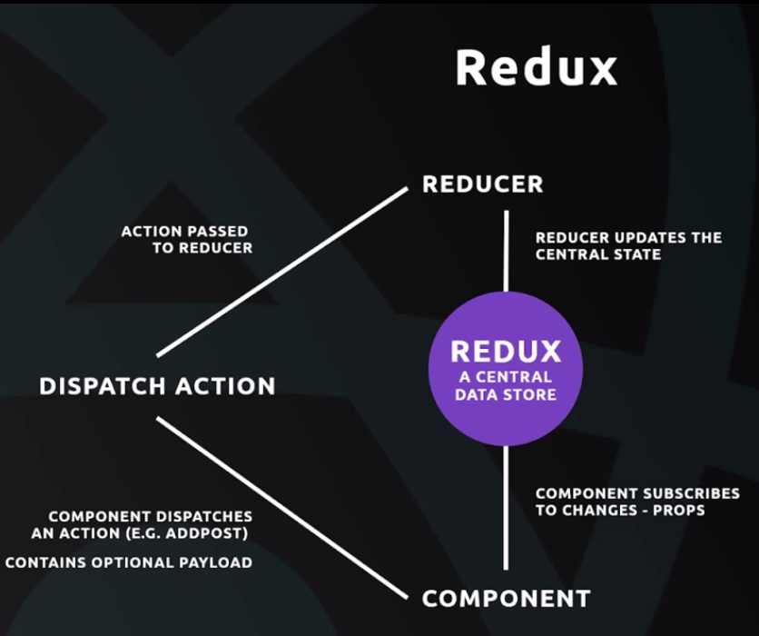

# React Works
#### Problems*** 
    If things don't work as expected, CHECK FOR SPELLING MISTAKES, FIRST

#### Requirements
    NodeJS version

#### App Creation
    npx create-react-app <app_name>
    cd <app_name>

#### Startup

    yarn start
    yarn build (For production build)

Properties:

    - React Apps are typically Single Page Apps. Doesn't request the server too often, just shows different components as required.
    - Only one HTML page will be served to the browser
    - React changes the content on the page dynamically.

Requirements:
    VS Code Extensions:

        1> Sublime Babel

        2> ES7 React/Redux/GraphQL
        
        3> Live Server(To Render the work)

    Chrome Extension:
        1> React Developer Tools
JSX is not supported in Browser. It needs to be transpiled using Babel for the Browser to understand.

Components:

State:
Keeping the UI and data in state in sync with each other. User interacts with 
# V1 - Getting started with React on single html page.

# Main - Creating  React App using  'Create React App' boilerplate
    For handling bigger projects with multiple components 
    Robust Development Platform using WebPack and Babel
    > Create app using 'create react app'
    Benefits:
        > Development Server
        > Use ES6 features which are not normally supported
        > Modular code
        > Using Build tools to create optimized code

#### Types of Components
Container Components(class) vs UI Components(function)
    * UI Components can be thought of just the internals of render method. No access to state. ONLY UI related work can be done here. Before its return (), we can also write Javascript as it is essentially a method.

    * Container Components dirctly get 'props' 
    Container Components with State using Classes
    - Contain State
    - Contain Lifecycle hooks
    - Not concerned with UI
    - Use classes to create

    UI Components without State using Functions(When we dont need the state and primarily purpose is UI )
    - Dont contain state
    - Receive data from props
    - Only concerned with UI
    - Use function to create 

# Learning

    1> spread -> ...    
     To create copy of array
    2> Destructuring : extracting values 
        let { vals } = props.vals

    Lifecycle Hooks:
    1> componentDidMount - Good Place to get external data from APIs. 
    2> componentDidUpdate
    3> componentDidUnmount

#### Routing 'react-router-dom'
    React Router:
    It stops the request from going to the sever by inject the components as requested

    > npm install react-router-dom
    
    import {BrowserRouter,Route,Switch} from 'react-router-dom';
    <BrowserRouter>
        <Switch>
             <Route path="/home" component={Home} /> 
        </Switch>
    </BrowserRouter>

    # This 'Switch' Tag -> Gives precedence to the match in the URL starting from the top, withing the Routes in the <Switch></Switch> tag.
    # Example: 
        url: "/123"
        <Switch>
            <Route path="/contact">
            <Route path="/:post_id">        # <------ Only matches it with this Route
        </Switch>

#### Navigation:

    import { Link,NavLink} from 'react-router-dom';
    <li><NavLink to="/contact">Contact</NavLink></li>
    // Use NavLink as a replacement for anchor tags. NavLinks have the 'active' property which can be useful for UI
    // Links enable react apps to take control and not call the server, but instead load the components locally

#### Programmatic Redirect :
    (Using settimeout() on 'props.history.push("/contact")')
    Every component redirected using Link receives the 'props' object.
    Other need to use the HigherOrder COmponents

#### Higher Order Components - Enhancing the functionality of a component
        # Reference => v4/src/hoc

        import {withRouter} from 'react-router-dom';
        ........
        export default withRouter(Navbar);
        => withRouter is a higher order component that supercharges a component and allows using props with it for more functionalities.

#### Fetching and Displaying Data from a third party API:

        We can use Axios(HTTP Request Library) to do this job. It uses promises and fetches the JSON data, which can the be used to change the state and then render appropriately

#### Setting Route-Parameters for API
        <Route path="/:post_id" component={Blog}>  

#### Images
    import images from the location inside "src" folder
    " alt="description" />

#  Redux
    - Central data store for all app data shared by the components
    - Any component can access data from it
    - makes state management easy

    
#### Elements of Redux

The main idea of redux is to have a central store of data that each component can reach out to and grab
    
    1> Reducer 
        (Uses Dispatch Actions to update the warehouse/central_component/state)
    
    2> Central Data Store (Javascript object that acts as a warehouse)

    3> Component - that subscribes to the changes in the store

    4> Dispatch Action

#### Setting up Redux in the project
    1> Install 2 Packages:
        > npm install redux react-redux 
        OR 
        > npm install redux 
        > npm install react-redux 
    
    2> In index.js 
        import { createStore } from 'redux';
        const store = createStore();

    3> TO interact with the store we need a Component called Provider from 'react-redux'

        -- import { Provider } from 'react-redux';

        *Allows store to interact with the react app
        Wraps  the <App /> component

        -- <Provider store={ store }><App /> </Provider>

    4> Create a reducer for the store. Make a folder reducer. We need more than one reducers.

    We create multiple reducers , which are that used by the 'root' reducer that is placed in the createStore() 

    4> Connecting Components with the Store

    We use HOC using a function called { connect } from 'react-redux' that creates a HOC and allows components to interact with redux and the store
    
    -- import {connect} from 'react-redux'

    We map the data from store to component using Props of the component
    // We tell the store what we want in the props of the component in mapStateToProps
    -- const mapStateToProps = (state) => {
        return {
            posts : state.posts
        }
    }

    // Then we use it in the connect()

    -- export default connect(mapStateToProps)(Home);

    5> Performing ACTIONS from the Component to the central store
    handleClick = () => {
        // We get the deletePost in 'this.Props'  because we added it to connect the Component to reducer in the export Component line below 
        this.props.deletePost(this.props.post.id);
    }
    -- create mapDispatchToProps = (dispatch) => {
        return {
            deletePost : (id) => { dispatch({ type:'DELETE_POST, id:id }) }
        }
    }

    // Then add this to connectMethod to the Wrapper around Component. These ,methods are available in the 'Props'
    -- export default connect(mapStateToProps,mapDispatchToProps)(Home);

    6> To Consolidate the actions so they can be used form anywhere, We use an action forder in "src" to store
    - src
       - actions
            - postActions.js

            // Inside postActions.js
            --- export const deletePost = (id ) => {
                return
                   { 
                       type:'DELETE_POST',
                       id:id
                    }
                }
    // Inside Component that makes use of this Action
    -- import  {}
                

